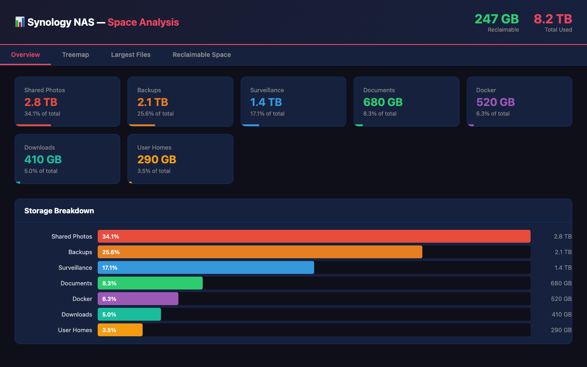

# Synology NAS Disk Space Analyzer and Cleanup Toolkit

Find out what's eating your NAS storage and clean it up. Run from your Mac — it handles everything over SSH and opens an interactive dashboard in your browser.

## Quick Start

```bash
git clone https://github.com/gneitzke/synologySpace.git
cd synologySpace
./run.sh admin@your-nas
```

That's it. On first run it will:
1. Offer to set up SSH keys (so you don't type your password repeatedly)
2. Deploy the analyzer to your NAS
3. Run a full disk scan (7 modules)
4. Pull the results back and open an interactive dashboard

After the first run, just `./run.sh` — it remembers your target.

```bash
./run.sh                      # re-run analysis
./run.sh --cleanup            # analysis + guided cleanup
./run.sh --dry-run            # cleanup preview (no changes)
./run.sh --module docker      # single module only
./run.sh other-user@other-nas # switch target
```

## What It Finds

| Module | Description |
|--------|-------------|
| `large_files` | Biggest files across all volumes |
| `large_dirs` | Biggest directories |
| `duplicates` | Duplicate files by checksum |
| `snapshots` | Old Btrfs snapshots |
| `docker` | Dangling images, stopped containers, unused volumes |
| `recycle_bins` | `#recycle` folder contents |
| `logs` | Oversized log files |

## Dashboard

The HTML dashboard (`reports/report.html`) has 4 tabs:
- **Overview** — Category cards + bar chart breakdown
- **Treemap** — WinDirStat-style interactive visualization
- **Largest Files** — Top 50 files by size
- **Reclaimable Space** — Actionable cleanup recommendations

A standalone treemap (`reports/treemap.html`) is also generated with drill-down navigation.

### Sample Terminal Output

```
════════════════════════════════════════════════════════════
  Synology Space Analysis Report
════════════════════════════════════════════════════════════

--- Large Files ---
    1.    59.5 GB  2025-08-31 01:18      /volume1/@synologydrive/@sync/repo/6/w/v/.R
    2.    59.5 GB  2025-08-19 01:27      /volume1/@synologydrive/@sync/repo/6/w/j/.r
    3.    59.5 GB  2025-03-22 08:20      /volume1/downloads/OctoPrint_EnderBackup.img
    4.    16.0 GB  2026-02-16 12:16      /volume1/homes/user/Drive/ROLLINGCACHE.CCC
    5.    13.2 GB  2023-02-11 01:10      /volume1/homes/user/Downloads/FarmingSim.img

--- Duplicate Files ---
  Found 12 duplicate groups
  Total wasted space: 73.2 GB

  Group 1: 59.5 GB × 3 copies (wasted: 119.0 GB)
    - /volume1/downloads/OctoPrint_EnderBackup.img
    - /volume1/homes/user/Drive/OctoPrint_EnderBackup.img
    - /volume1/@synologydrive/@sync/repo/5/e/H/.h

--- Recycle Bins (42 files) ---
  iCloudBackup                       78.3 MB  (31 files)
  downloads                          12.1 MB  (11 files)

  Total reclaimable: 90.4 MB

--- Summary - Reclaimable Space by Category ---
  Duplicate Files            73.2 GB  ████████████████████████████████████████
  Large Files (top 20)       45.8 GB  █████████████████████████
  Recycle Bins               90.4 MB  █
  Log Files                  12.3 MB  █

  Total reclaimable: 119.1 GB
```

### Sample HTML Dashboard

The dark-themed dashboard opens automatically in your browser:



## Cleanup

```bash
./run.sh --cleanup    # interactive, with y/n confirmations
./run.sh --dry-run    # preview only, no changes made
```

Categories: empty recycle bins, remove old snapshots, prune Docker, clean logs, review large files. Every action requires explicit confirmation.

## Requirements

- macOS (for the remote runner; Linux works too but `open` won't auto-launch browser)
- SSH access to your Synology NAS (DSM 7.x)
- sudo/root on the NAS (for full scan)
- Python 3 on the NAS (included in most DSM installs)

## Project Structure

```
synologySpace/
├── run.sh               # ← Start here (runs everything from your Mac)
├── analyze.sh           # Analysis orchestrator (runs on NAS)
├── report.py            # Dashboard + report generator
├── treemap.py           # Treemap visualization
├── cleanup.py           # Interactive cleanup tool
├── modules/             # 7 analysis modules
├── lib/                 # Shared utilities
└── reports/             # Downloaded results (gitignored)
```

## License

MIT
